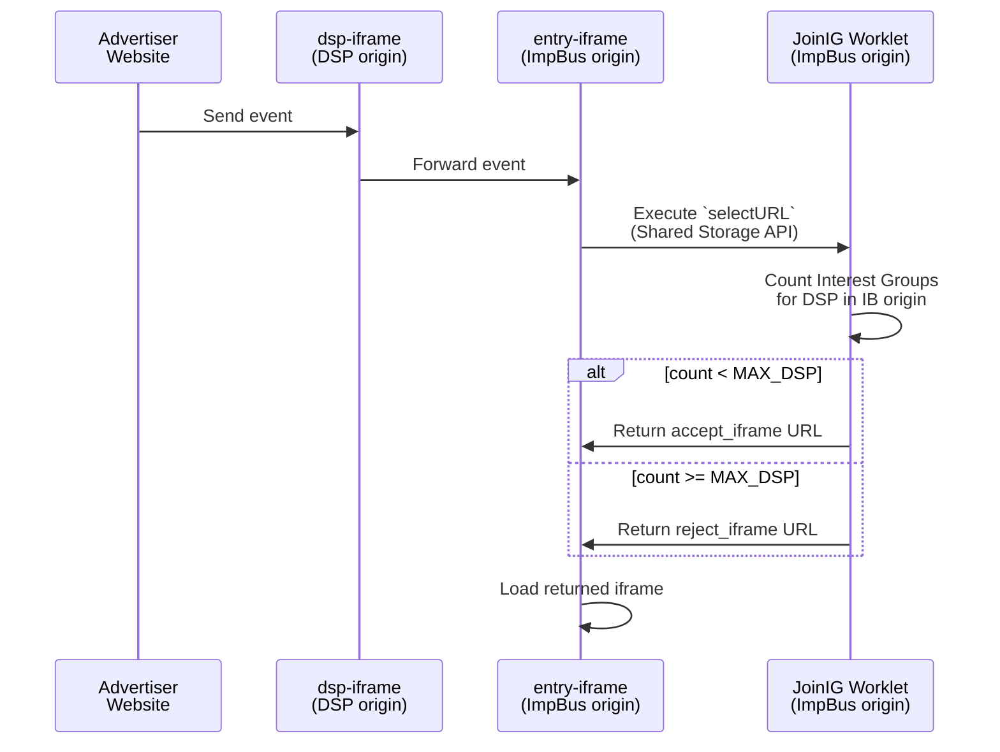
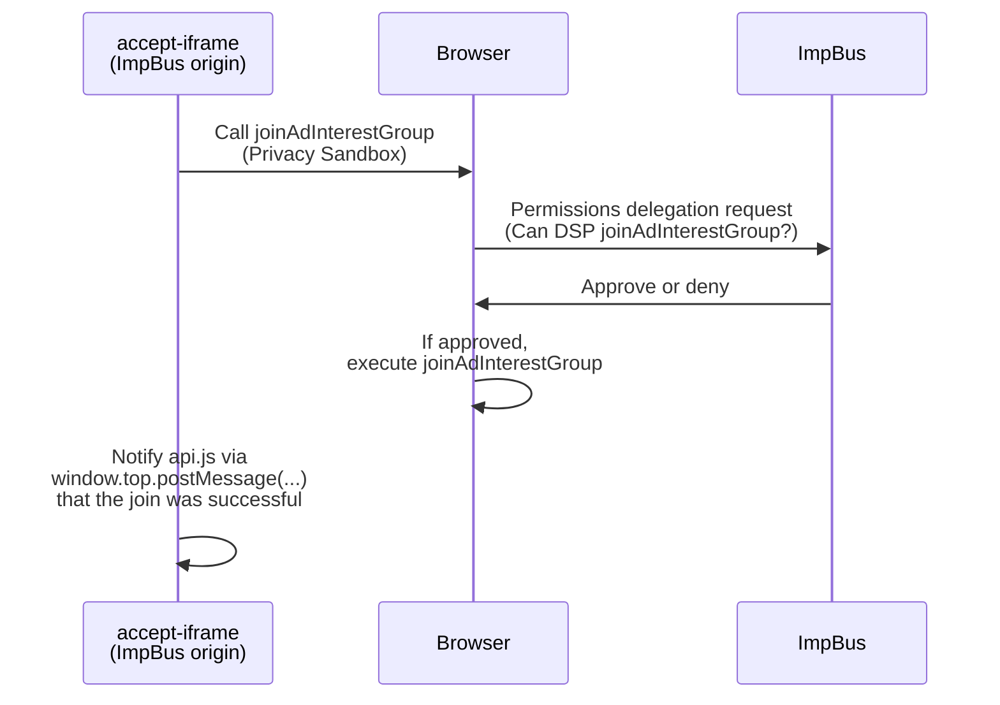
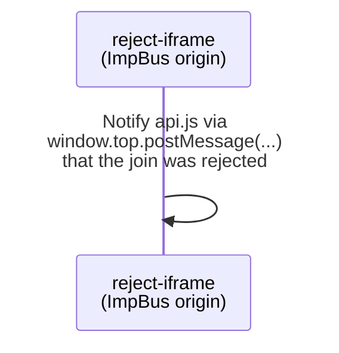

# Signature

```typescript
ebapi.registerBiddingSignal(name:string, value:string): Promise
```

- **Arguments**
 	- `name` (string) - The signal name.
 	- `value` (string) - The signal value.
- **Returns**
 	- A `Promise` that resolves once the operation is complete.

# Example

```typescript

import ebapi from 'ebapi';

ebapi.init("https://my-dsp.example");

// ...

ebapi.registerBiddingSignal("MY_SIGNAL", "124849560").then(result => {
 console.log("Bidding signal registered?", result);
})
```

# Origin hand-off during `registerBiddingSignals`

| Step | Executed by       | Operation                                          | Running in Origin |
| ---- | ----------------- | -------------------------------------------------- | ----------------- |
| 1    | Advertiser or DSP | Call `registerBiddingSignals(...)`                 | Advertiser        |
| 2    | `api.js`          | Send event to `dsp-iframe`                         | Advertiser        |
| 3    | `dsp-iframe`      | Forward event to `entry-iframe`                    | DSP               |
| 4    | `entry-iframe`    | Perform a `selectURL` using **JoinIG** worklet     | ImpBus            |
| 5    | `JoinIG`          | Count DSP interest groups                          | ImpBus            |
| 6    | `JoinIG`          | Return `accept-frame` if the DSP is below limit    | ImpBus            |
| 7    | `JoinIG`          | Return `reject-frame` if the DSP has reached limit | ImpBus            |
| 8    | `entry-iframe`    | Render returned frame                              | ImpBus            |

# Sequence Diagram



## If `accept_url` is loaded



## If `reject_url` is loaded


