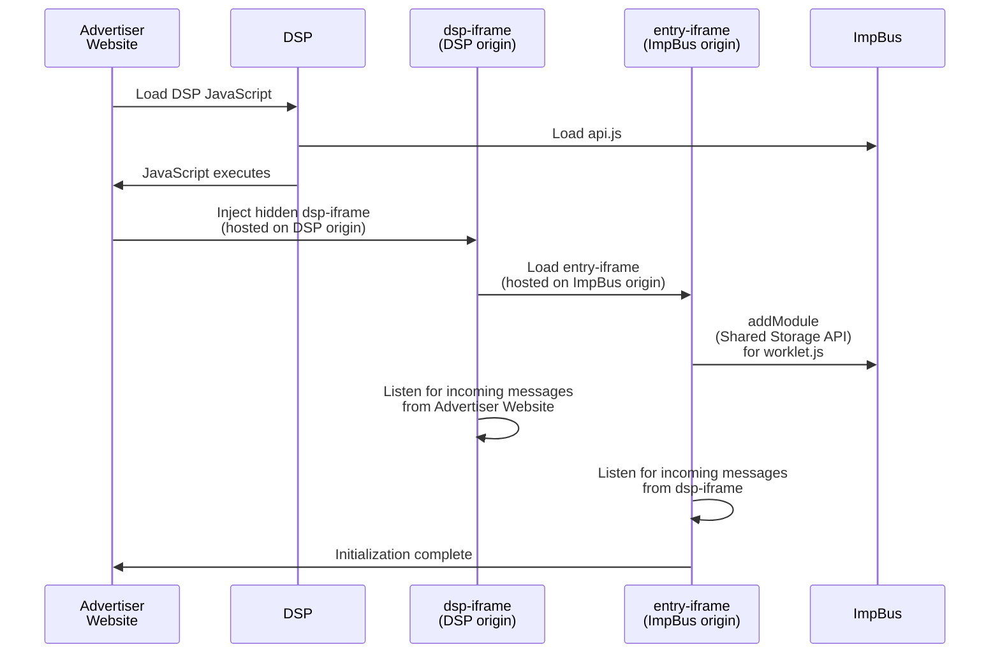

# Initial Setup

Be sure you have [[Installation|installed]] the API before initialization.

## Signature

```typescript
ebapi.init(dspOrigin:string, opts:InitOptions|undefined):Promise
```

- **Arguments**
	- `dspOrigin` - The [[What is an origin|origin]] of your DSP.
	- `opts` - _(optional)_ - JavaScript object with additional initialization options:
		- `frameSrc`
			- The location of the [[DSP Iframe]]. It must exist within the `dspOrigin`.
			- This will default to `<dsp-origin>/dsp-iframe.html` if not specified.
		- `async`
			- Whether to load the DSP frame asynchronously.
			- Defaults to `true`.
- **Returns**
	- A `Promise` that resolves once the initialization has completed.

## Example

```typescript
import ebapi from 'ebapi';

await ebapi.init("https://my-dsp.example", {
	frameSrc: "https://my-dsp.example/cdn/my-custom-frame-location.html"
});
```

## Origin hand-off during initialization

| Step | Executed by        | Operation                                    | Running in Origin |
| ---- | ------------------ | -------------------------------------------- | ----------------- |
| 1    | Advertiser website | Load DSP JavaScript                          | Advertiser        |
| 2    | Advertiser website | Execute DSP JavaScript                       | Advertiser        |
| 3    | DSP JavaScript     | - Import **api.js** from ImpBus origin       | Advertiser        |
| 4    | DSP JavaScript     | - Execute `ebapi.init(...)`                  | Advertiser        |
| 5    | api.js             | Inject **DSP iframe** living in DSP origin   | Advertiser        |
| 6    | DSP iframe         | Add **entry iframe** living in ImpBus origin | DSP               |
| 7    | DSP iframe         | Go idle and wait for incoming messages       | DSP               |
| 8    | entry iframe       | Import **JoinIG worklet** via Shared Storage | ImpBus            |
| 9    | entry iframe       | Go idle and wait for incoming messages       | ImpBus            |

## Sequence Diagram

When a user visits an advertiser managed by the DSP, the following steps occur in order to load & initialize the external bidder API.



## Up Next

See: [[Registering a Bidding Signal]]
