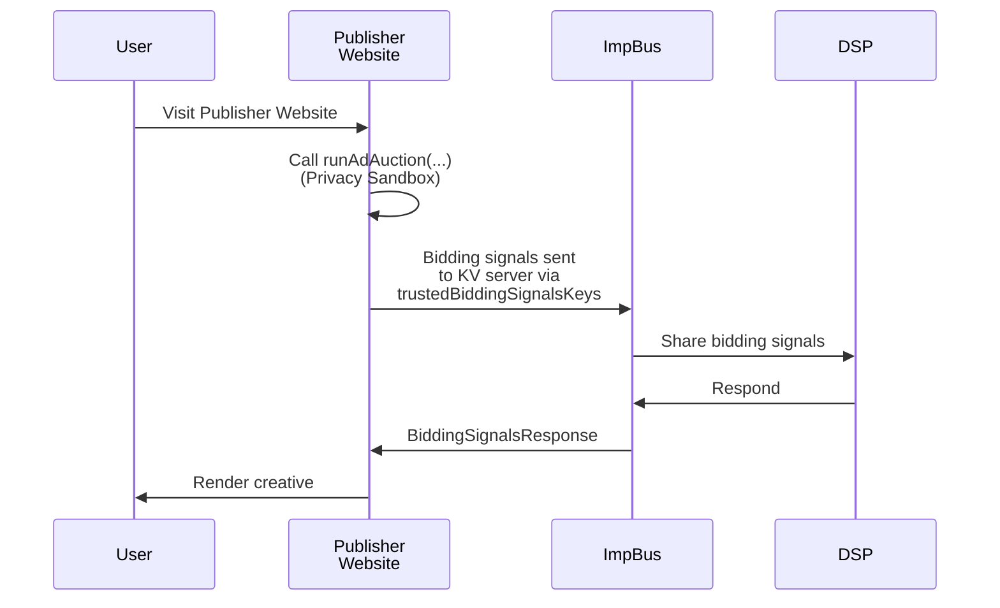

```mermaid
sequenceDiagram
    participant U as User
    participant Pub as Publisher<br/>Website
    participant IB as ImpBus
    participant DSP as DSP

    U->>Pub: Visit Publisher Website
    Pub->>Pub: Call runAdAuction(...)<br/>(Privacy Sandbox)
    Pub->>IB: Bidding signals sent<br/>to KV server via <br/>trustedBiddingSignalsKeys
    IB->>DSP: Share bidding signals
    DSP->>IB: Respond
    IB->>Pub: BiddingSignalsResponse
    Pub->>U: Render creative
```